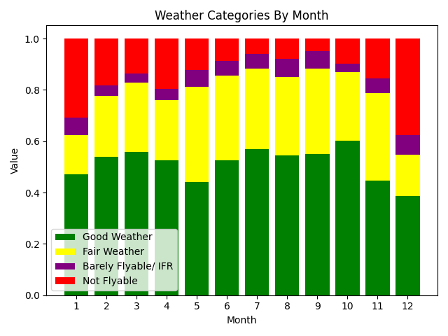
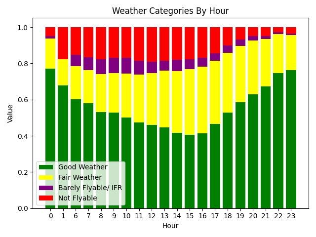

# UND-Flight-Restriction-Data-Analysis

This is a statistical analysis of UND flight restrictions data collected over the course of 3 years from March 2023 to March 2026. Data collection during this time was not 100% consistent, as there are some gaps in the data. The biggest is from September-8 2024 to November-19 2024 due to a crash in the data collection program. Data loss has been corrected for through data normalization. 

The collection process involved running the website scraper for 3 years. The scraper is still running, and the data may be updated in the future. 

Conclusions from data collected:

Looking at flight weather by month, the winter months have the worst weather, and late summer and early fall has the best weather. 

An analysis of flight weather by hour reveals that the best time to fly is early or late in the day, and the worst weather typically occurs from Noon to 5pm. 

A further hourly break down by month can be found in the Graphs/ByHourByMonth folder. 